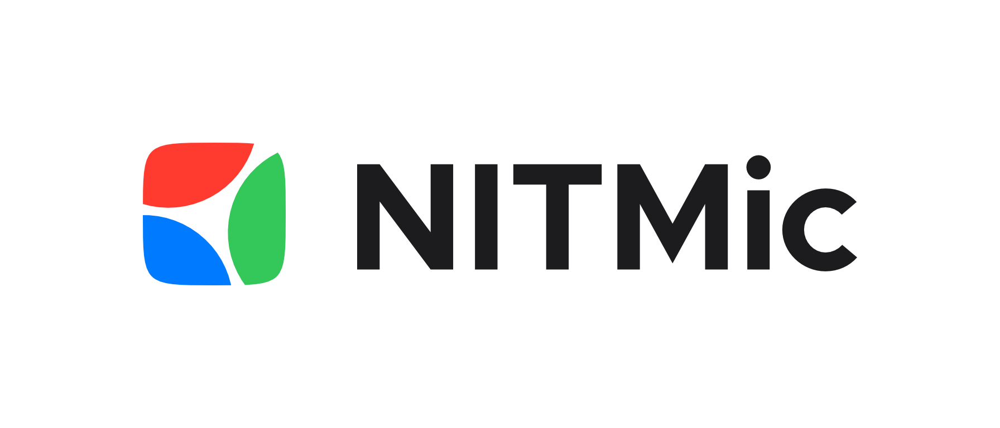
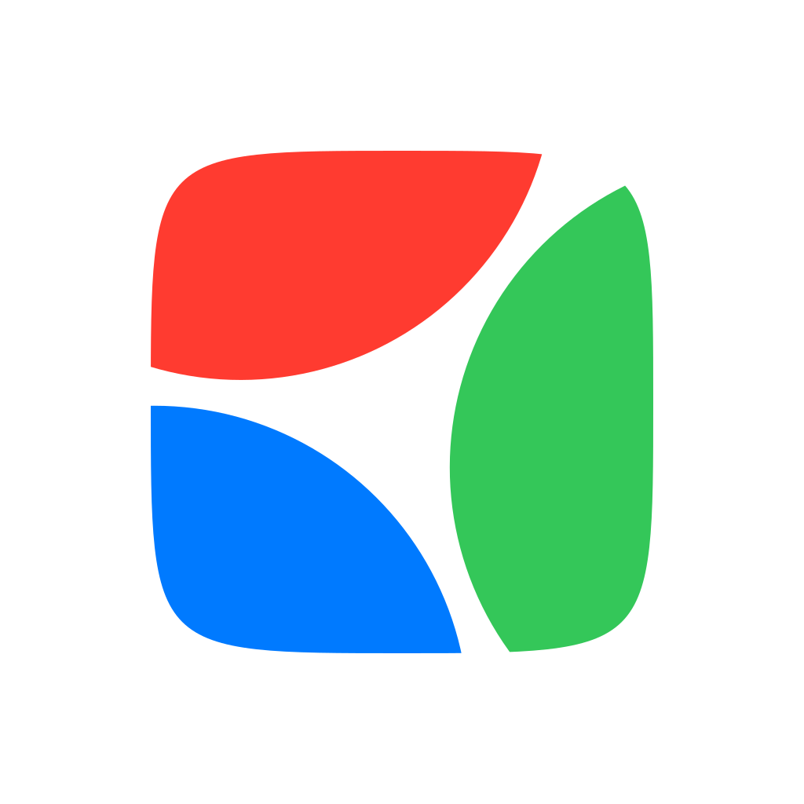

# NITMic ロゴ

## タイプ

いくつか種類を用意しているので，目的に最適な素材を選択してください．

- アイコン
- ロゴ
- ロゴマーク

### アイコン

主に X（旧 Twitter）などの円形アイコンで使用することを想定した素材です．

| Icon 1 | Icon 2 | Icon 3 |
| :---: | :---: | :---: |
|  |  |  |
| ロゴマークのみ | ロゴマークとロゴタイプ | ロゴタイプのみ |

### ロゴ

主に Web サイトや印刷物などで使用することを想定した素材です．

| Logo Expand | Logo Floating |
| :---: | :---: |
|  |  |
| 背景を含む | 背景を含まない |

### ロゴマーク

アイコンやロゴに使用されているロゴマークのみの素材です．
GitHub や Zenn などの四角で角が丸くトリミングされるサービスに使用する場合や，ポスターなどでロゴマークを単体で使用する場合に使用してください．

| Logomark Expand | Logomark Floating |
| :---: | :---: |
|  |  |
| 角丸処理なし | 角丸処理あり |

## テーマ

ダークテーマとライトテーマを用意しています．

| Light | Dark |
| :---: | :---: |
|  |  |

## カラー

カラー版とグレースケール版を用意しています．

| Color | Gray |
| :---: | :---: |
|  |  |

## 拡張子

拡張子は PNG と SVG を用意しています．
PNG は SNS などのアイコン用に使用してください．
3 つのサイズを用意してあるので，サービスの要求に合わせて選択してください．
SVG は Web サイトや印刷物用に使用してください．

| PNG @0.5x | PNG @1x | PNG @4x | SVG |
| :---: | :---: | :---: | :---: |
|  |  |   |  |
| 512 x 512 | 1024 x 1024 | 4096 x 4096 | Scalable |

## 編集環境

[Affinity Designer 2](https://affinity.serif.com/ja-jp/designer/) で作成しています．

配色は [Apple のカラーガイドライン](https://developer.apple.com/design/human-interface-guidelines/color) を使用しています．

フォントは [Inter](https://rsms.me/inter/) を使用しています．
[Google Fonts](https://fonts.google.com/specimen/Inter) や [Adobe Fonts](https://fonts.adobe.com/fonts/inter-variable) で無料でダウンロードできます．
