# NITMic ロゴ

## ダウンロード方法

[こちら](https://github.com/nitmic/logo/archive/main.zip) から素材を一括してダウンロードできます．

## 種類

いくつか種類を用意しているので，目的に最適な素材を選択してください．
大きくアイコンとロゴに分かれています．

### アイコン

主に SNS などのアイコンに使用することを想定した素材です．

| Icon Square | Icon Round Square | Icon Circle |
| :---: | :---: | :---: |
| 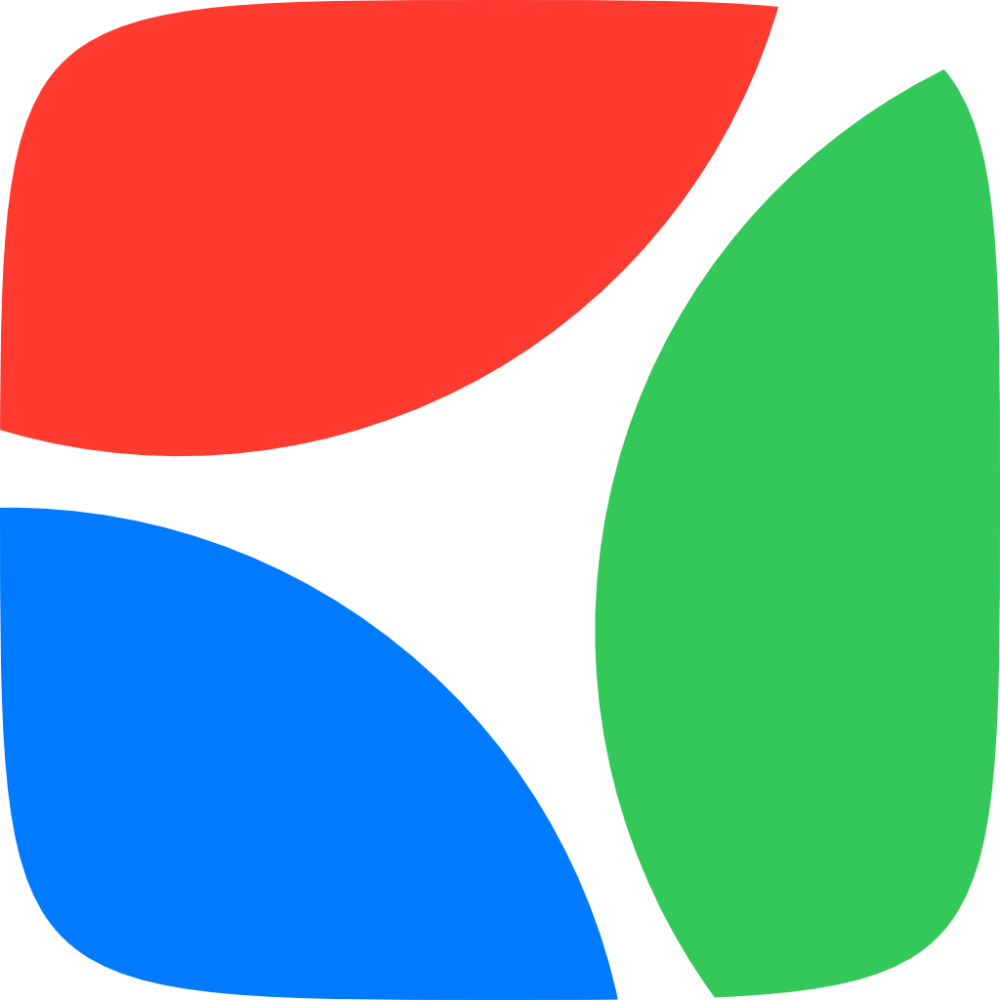 | 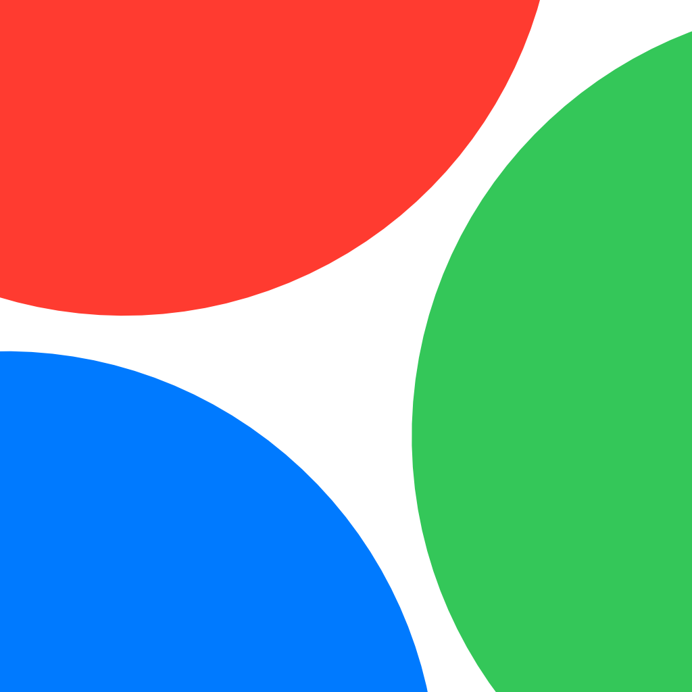 | 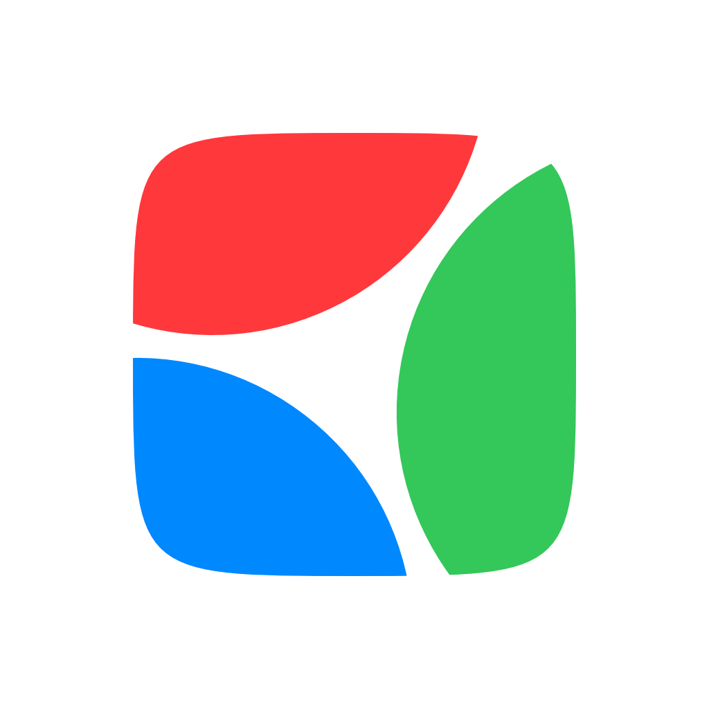 |
| favicon などのトリミングされないサービス用 | GitHub などの角丸四角形にトリミングされるサービス用 | X（旧 Twitter）などの丸にトリミングされるサービス用 |

### ロゴ

主に Web サイトや印刷物などで使用することを想定した素材です．

| Logo Short | Logo Horizontal | Logo Vertical |
| :---: | :---: | :---: |
| 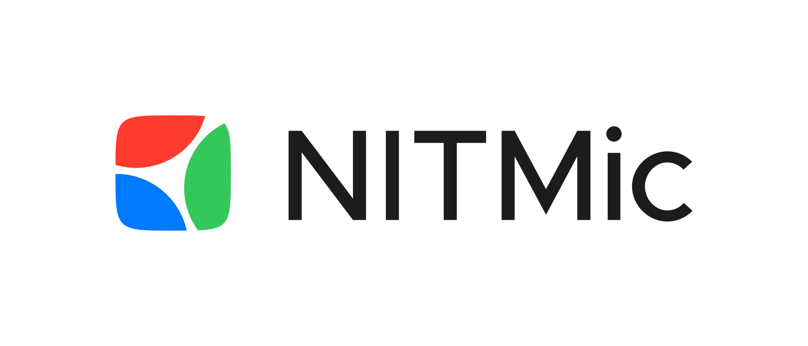 | 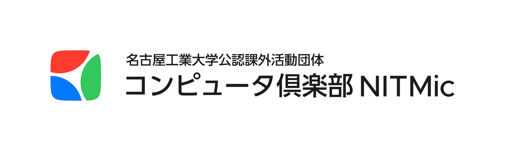 | 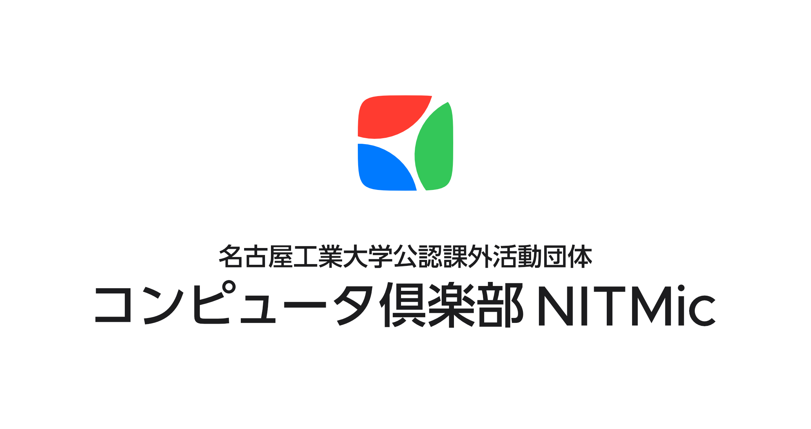 |
| 略称のみを使用したロゴ | 正式名称を使用したヨコ向きのロゴ | 正式名称を使用したタテ向きのロゴ |

## 配色パターン

ロゴについては，6 つの配色パターンを用意しています．
背景の明るさや写真かどうかなどに応じて適切な配色を選択してください．

| | Light | Dark |
| :---: | :---: | :---: |
| Color Opaque |  | 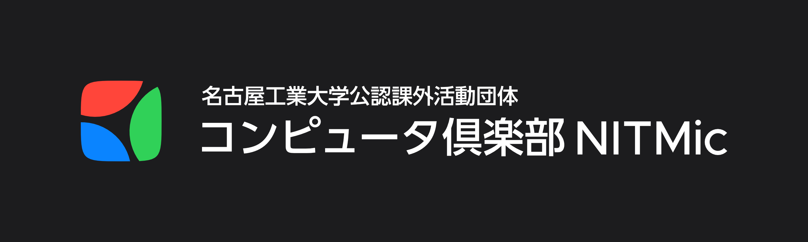 |
| Color Transparent | 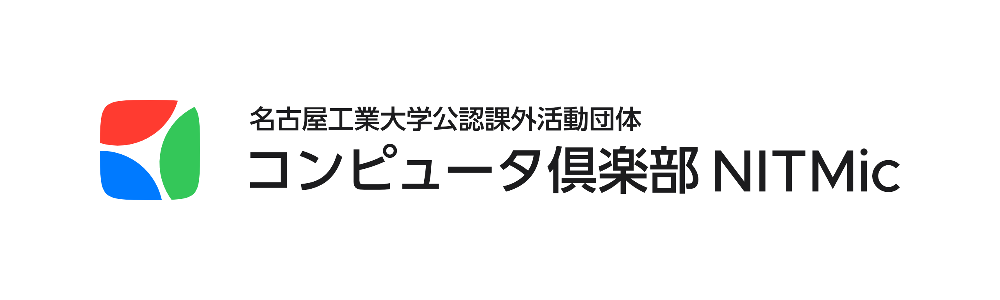 | 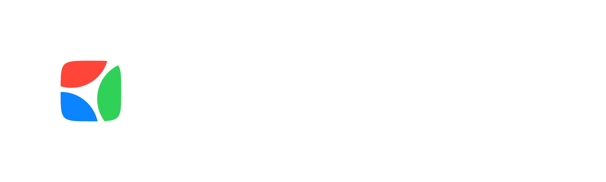 |
| Gray |  | 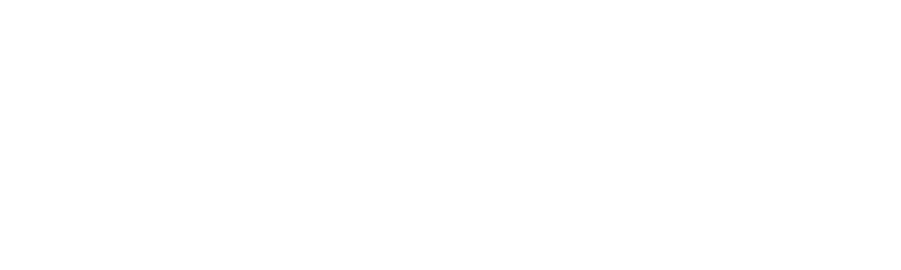 |

## 拡張子

拡張子は PNG と SVG を用意しています．
PNG は SNS などのアイコン用に使用してください．
3 つのサイズを用意してあるので，サービスの要求に合わせて選択してください．
SVG は Web サイトや印刷物用に使用してください．

| PNG @0.5x | PNG @1x | PNG @4x | SVG |
| :---: | :---: | :---: | :---: |
|  |  |  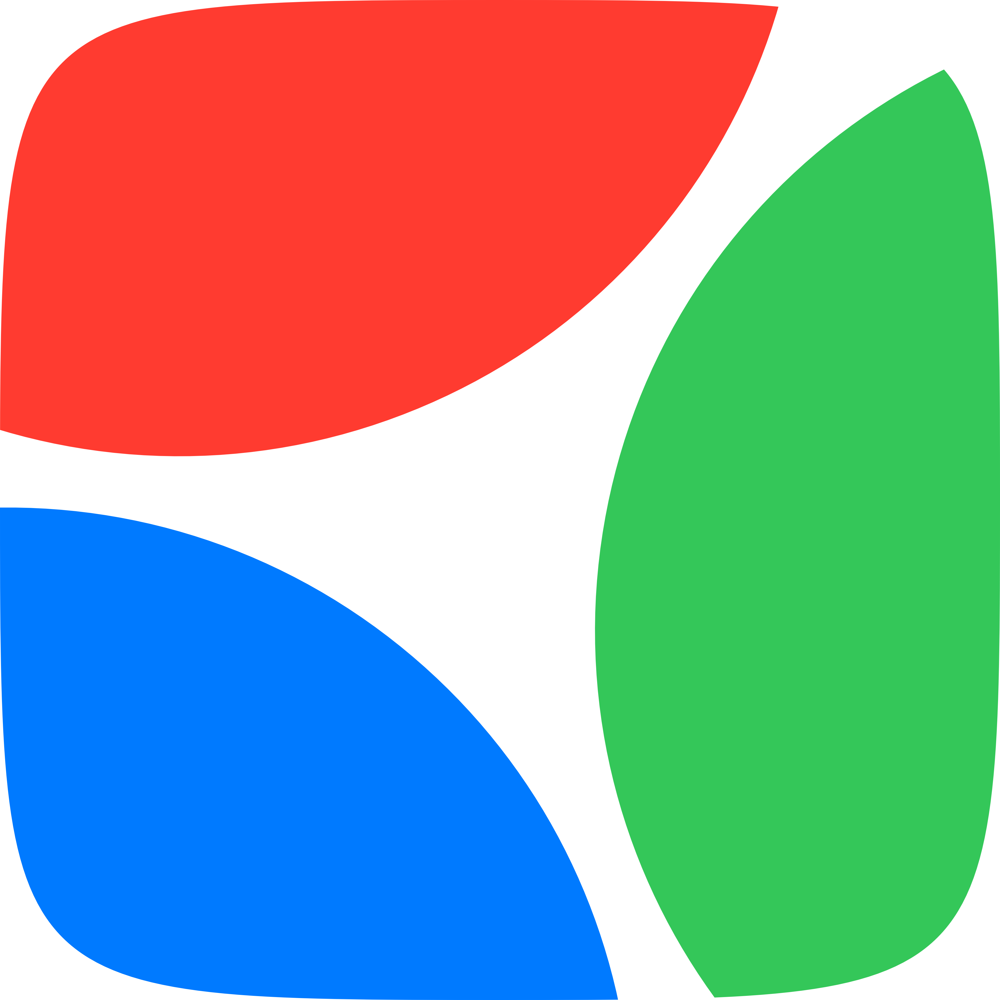 |  |
| 512 x 512 | 1024 x 1024 | 4096 x 4096 | Scalable |

## 編集環境

編集ソフトは [Affinity Designer 2](https://affinity.serif.com/ja-jp/designer/) です．

配色は [Apple のカラーガイドライン](https://developer.apple.com/design/human-interface-guidelines/color) を使用しています．

フォントは [Metropolis](https://fontsarena.com/metropolis-by-chris-simpson/) と [UD 新ゴ](https://morisawafonts.com/fonts/228/) を使用しています．
Metropolis は [Font Arena](https://fontsarena.com/metropolis-by-chris-simpson/) から無料でダウンロードできます．
UD 新ゴは [Morisawa Fonts](https://morisawafonts.com/) から学生なら年額 990 円（税込）でサブスクリプションできます．
