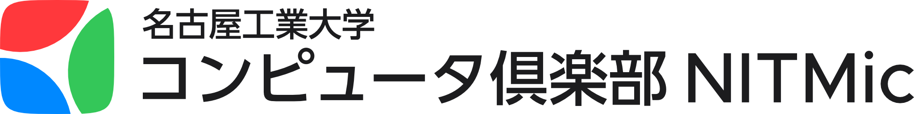
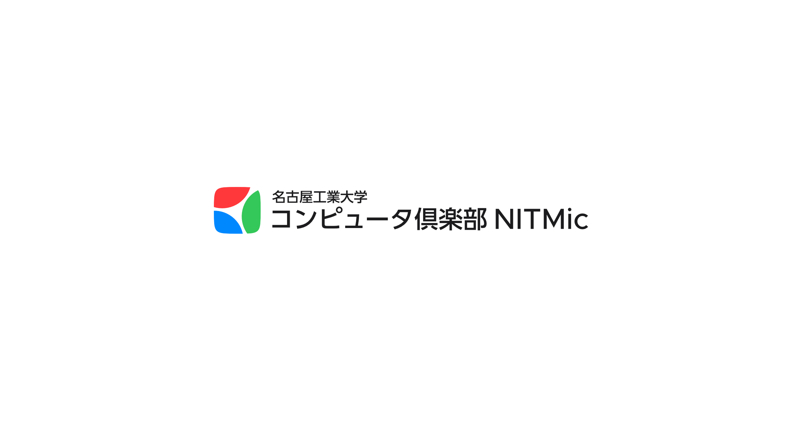
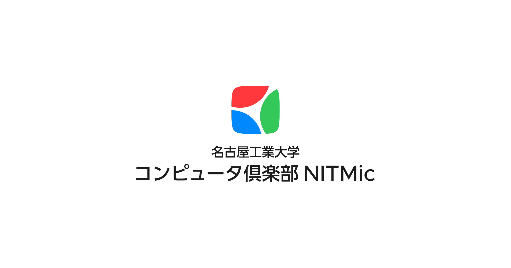
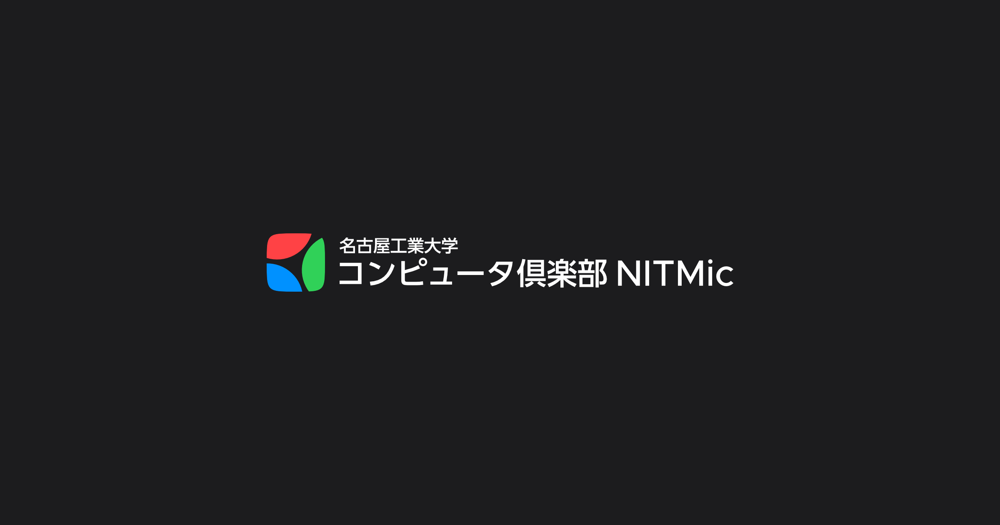

# NITMic ロゴ

## ダウンロード方法

[こちら](https://github.com/nitmic/logo/archive/main.zip) から素材を一括してダウンロードできます．

## 種類

いくつか種類を用意しているので，目的に最適な素材を選択してください．
大きく以下の 3 種類に分類されます：

- アイコン
- ロゴ
- 余白付きロゴ

### アイコン

主に SNS などのアイコンに使用することを想定した素材です．
3 つの形状を用意しています．
サービスごとのトリミングの仕様に合わせて適切な形状を選択してください．

| Icon Square | Icon Round Square | Icon Circle |
| :---: | :---: | :---: |
|  |  |  |
| favicon などのトリミングされないサービス用 | GitHub などの角丸四角形にトリミングされるサービス用 | X（旧 Twitter）などの丸にトリミングされるサービス用 |

### ロゴ

主に Web サイトや印刷物などで使用することを想定した素材です．
4 つの配色パターンを用意しています．
背景の明るさや写真かどうかなどに応じて適切な配色を選択してください．

| Logo Short | Logo Horizontal | Logo Vertical |
| :---: | :---: | :---: |
|  |  |  |
|  |  |  |
|  |  |  |
|  |  |  |

### 余白付きロゴ

主に SNS のプロフィールの背景や Web サイトのサムネイルなどで使用することを想定した素材です．
背景色と余白が設定されているので，そのまま使用できます．
2 つの配色パターンを用意しています．
背景の明るさや写真かどうかなどに応じて適切な配色を選択してください．

| Logo Short | Logo Horizontal | Logo Vertical |
| :---: | :---: | :---: |
|  |  |  |
|  |  |  |

## ファイル形式

ファイル形式は PNG と SVG を用意しています．
PNG は SNS などのアイコン用に使用してください．
2 つのサイズを用意してあるので，サービスの要求に合わせて選択してください．
SVG は Web サイトや印刷物用に使用してください．

| PNG @0.5x | PNG @1x | SVG |
| :---: | :---: | :---: |
|  |  |  |
| 512 x 512 | 1024 x 1024 | Scalable |

## 編集環境

編集ソフトは [Affinity Designer 2](https://affinity.serif.com/ja-jp/designer/) です．

配色は [Apple のカラーガイドライン](https://developer.apple.com/design/human-interface-guidelines/color) を使用しています．

フォントは [Metropolis](https://fontsarena.com/metropolis-by-chris-simpson/) と [UD 新ゴ](https://morisawafonts.com/fonts/228/) を使用しています．
Metropolis は [Font Arena](https://fontsarena.com/metropolis-by-chris-simpson/) から無料でダウンロードできます．
UD 新ゴは [Morisawa Fonts](https://morisawafonts.com/) から学生なら年額 990 円（税込）でサブスクリプションできます．
