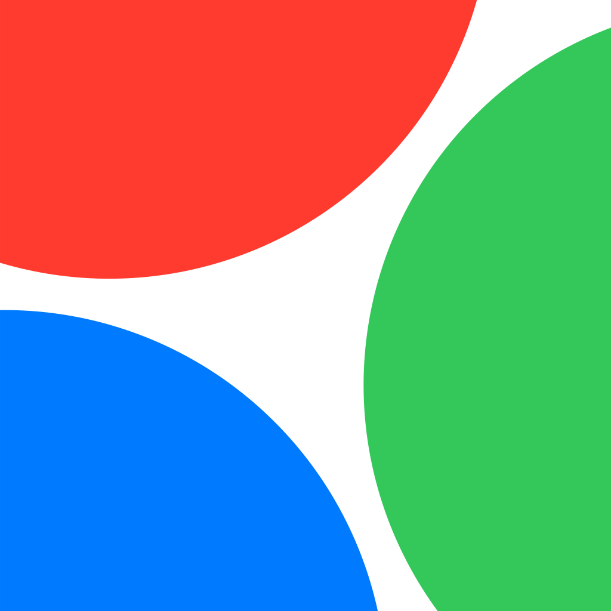
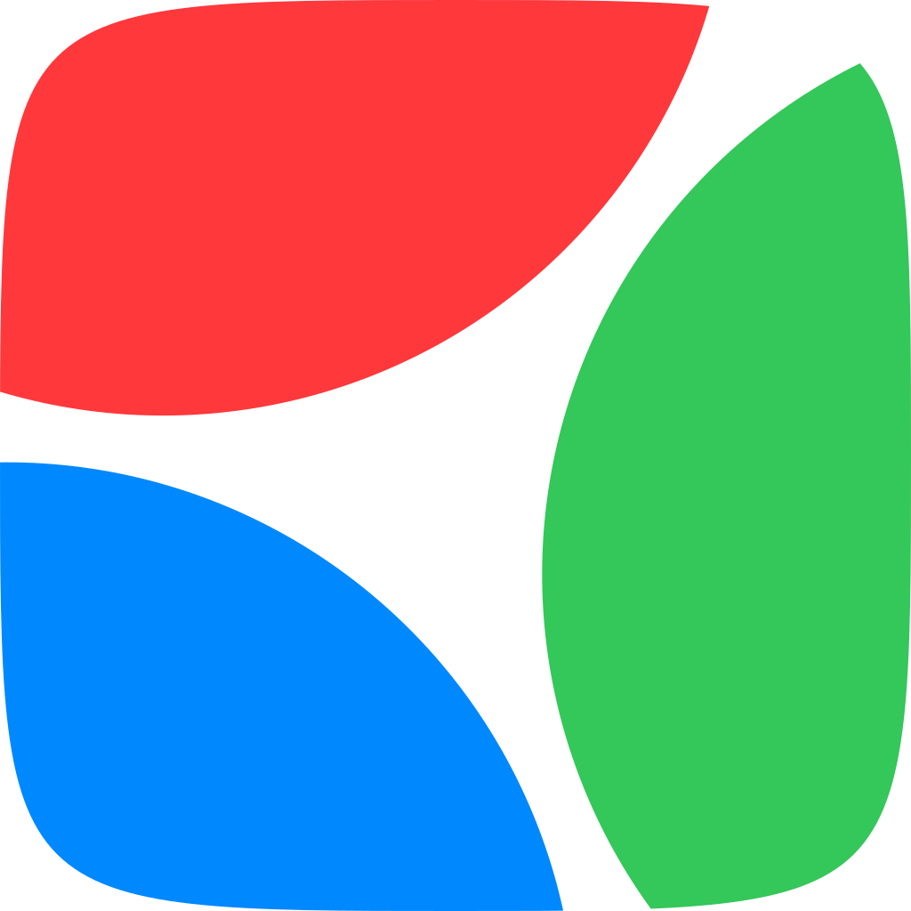
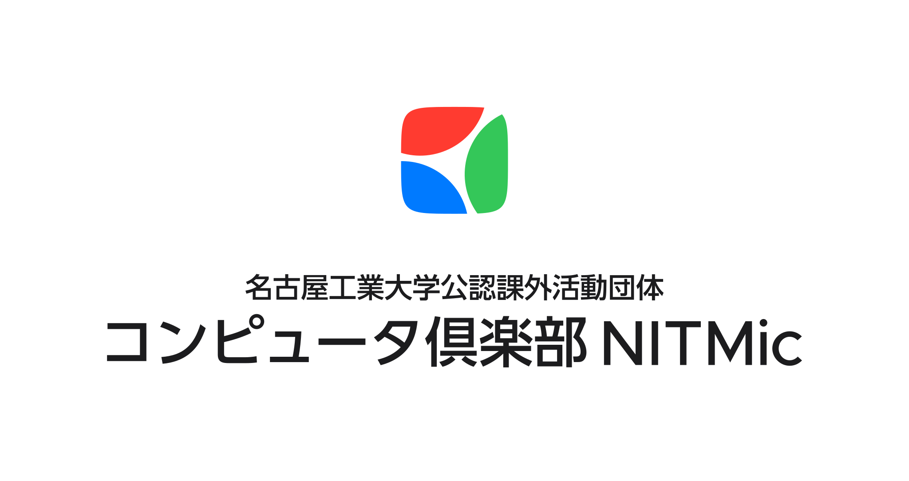
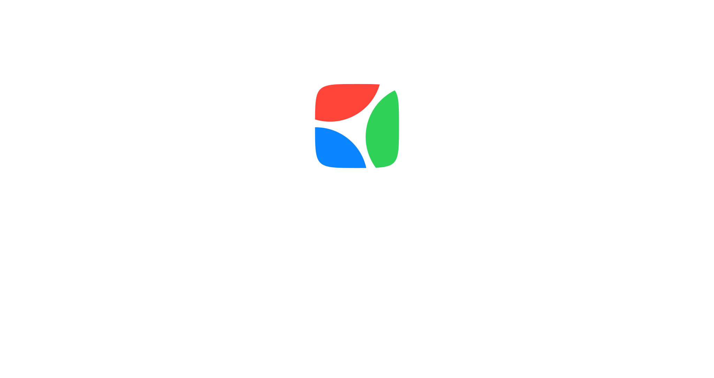
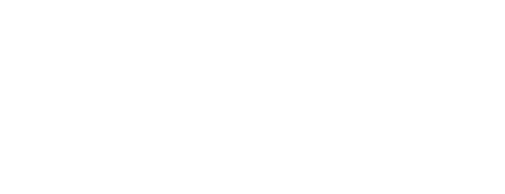

# SVG

## アイコン

| Icon Circle | Icon Round Square | Icon Square |
| :---: | :---: | :---: |
|  |  |  |

## ロゴ

| Logo Short | Logo Horizontal | Logo Vertical |
| :---: | :---: | :---: |
|  |  |  |
|  |  |  |
|  |  |  |
|  |  |  |
|  |  |  |
|  |  |  |
